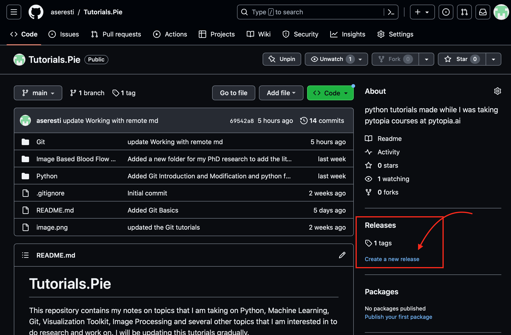
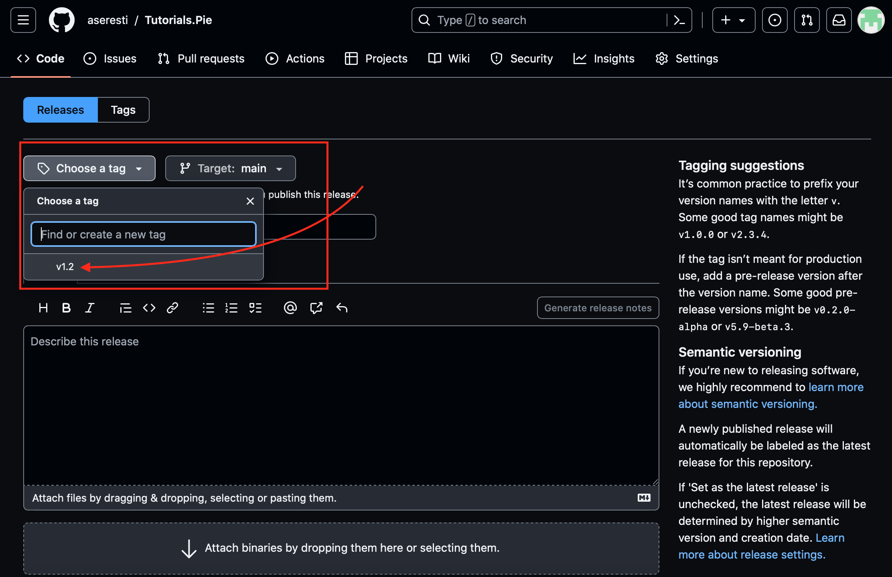
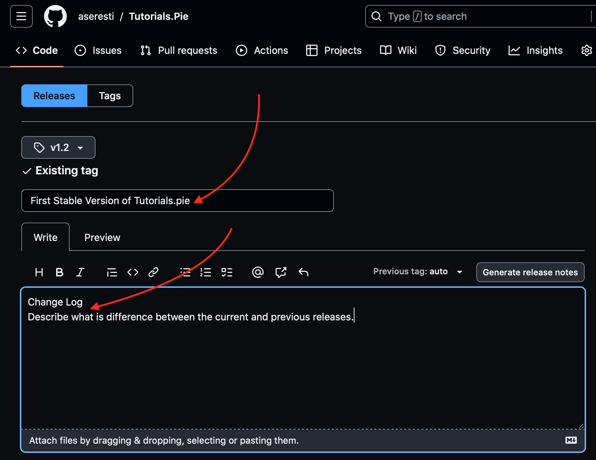
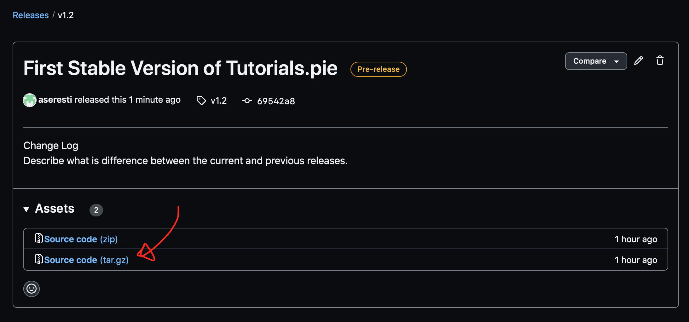

# Tagging
Tgging is the ability of specifying a certain point in the history to mark a certain point that you want to release a stable version of your work like version 1.0 (v1.0).
To list the git tags you can use `git tag`
To create a tag on your last version, you can use `git tag [tag_name]` such as `git tag v1.0`.
Now the tag that you have created must appear on your history log.
```
$ git tag
$ git tag v1.0
$ git tag
v1.0
$ git log -1
commit 69542a88e9b2cb0d104ec64815d274c83d1f125e (HEAD -> main, tag: v1.0, origin/main, origin/HEAD)
Author: Anahita Seresti <aseresti@ryerson.ca>
Date:   Wed Aug 30 11:19:56 2023 -0400

    update Working with remote md
```
As a result we have added a tag to the last made commit. However, this "light weight" tag does not indicate any specific information. To have an annotated tag we need to use a `-a` to add a message to describe the tag as well. `git tag v1.2 -a` as a result of this command a new window gets input the tag message. You may also use 
```
git tag -a v1.2 -m "pre-release for new software"
```
You can use `git show [tag-name]` to get the information on the tag information.
```
$ git show v1.2
tag v1.2
Tagger: Anahita Seresti <aseresti@ryerson.ca>
Date:   Wed Aug 30 15:39:23 2023 -0400

pre-release

commit 69542a88e9b2cb0d104ec64815d274c83d1f125e (HEAD -> main, tag: v1.2, tag: v1.0, origin/main, origin/HEAD)
Author: Anahita Seresti <aseresti@ryerson.ca>
Date:   Wed Aug 30 11:19:56 2023 -0400

    update Working with remote md

diff --git a/Git/Git Basics/09. Working with Remotes.md b/Git/Git Basics/09. Working with Remotes.md
index 90116ad..1b986aa 100644
--- a/Git/Git Basics/09. Working with Remotes.md        
+++ b/Git/Git Basics/09. Working with Remotes.md        
@@ -7,15 +7,20 @@ You need to copy the https or ssh url of the repository and use `git clone <url>
 ## Push an existing local repository from the Command Line
 If you want to check if there is any remote repository connected to your local repository use the command line `git remote`.
```
This command shows the commit information for the light weight tags and the tag information plus commit information for annotated tags.
Now if we want to tag a certain older commit you can add the commit id to your command: `git tag [tag] <commit-id>`
```
$ git log --oneline
69542a8 (HEAD -> main, tag: v1.2, tag: v1.0, origin/main, origin/HEAD) update Working with remote md
bddadd9 Add the Git Basics folder and moved everything into that
839bfcd Add working with remote md file
78809e3 Add Git Basics
757a4d6 Added Git Basics
40d5e77 Added Git Introduction and Modification and python first time setup
831f12e Added a new folder for my PhD research to add the literature and coding
2b4a534 updated the Git tutorials
3dd7ae7 updated repo's readme
28d284c updated repo's readme
4175e05 updated repo's readme
88a2810 Update README.md
e6cf670 Added the git crash course notebook to the tutorial folder.
114c6da Initial commit
$ git tag v0.9 78809e3
$ git log --oneline
69542a8 (HEAD -> main, tag: v1.2, tag: v1.0, origin/main, origin/HEAD) update Working with remote md
bddadd9 Add the Git Basics folder and moved everything into that
839bfcd Add working with remote md file
78809e3 (tag: v0.9) Add Git Basics
757a4d6 Added Git Basics
40d5e77 Added Git Introduction and Modification and python first time setup
831f12e Added a new folder for my PhD research to add the literature and coding
2b4a534 updated the Git tutorials
3dd7ae7 updated repo's readme
28d284c updated repo's readme
4175e05 updated repo's readme
88a2810 Update README.md
e6cf670 Added the git crash course notebook to the tutorial folder.
114c6da Initial commit
```
You can also create an annotated tag this way:
```
$ git tag [tag-name] -a -m "[tag-message]" <commit-id>
```
The point of adding a tag is that to be appeared on remote repository, so other people can see the stable releases on you repoitory. Therefore, these tags should be pushed on the remote repository.
Note that the light weight tag is for your personal use to add a check point on your log history.
To push a tag on your remote repository use `git push [remote-name] [tag]`:
```
$ git push origin v1.2
Enumerating objects: 1, done.
Counting objects: 100% (1/1), done.
Writing objects: 100% (1/1), 165 bytes | 165.00 KiB/s, done.
Total 1 (delta 0), reused 0 (delta 0)
remote: This repository moved. Please use the new location:
remote:   https://github.com/aseresti/Tutorials.Pie.git
To https://github.com/aseresti/python-tutorials.git
 * [new tag]         v1.2 -> v1.2
```
To push all tags at the same time you should use `git push origin --tag`
To create a new release to your project, on your github repository you can find Releases section at the right side of the page. By clicking on the new release you can select an existing tag as your release and add a description for that.







Change log is where you should describe the differences between your current release and previous one. After releasing the selected version it would be accessible under the release section of your repository and one can download .zip and tar.gz files of the source code.



To delete all of the tags at the same time you can create a tunnel on terminal command:
```
$ git tag | xargs git tag --delete
Deleted tag 'v0.9' (was 78809e3)
Deleted tag 'v1.0' (was 69542a8)
Deleted tag 'v1.2' (was 3b1311d)
```
You can also delete the pushed tags and releases manually on the remote repository.